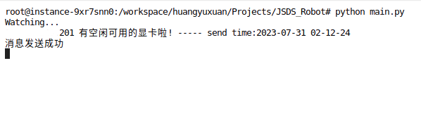
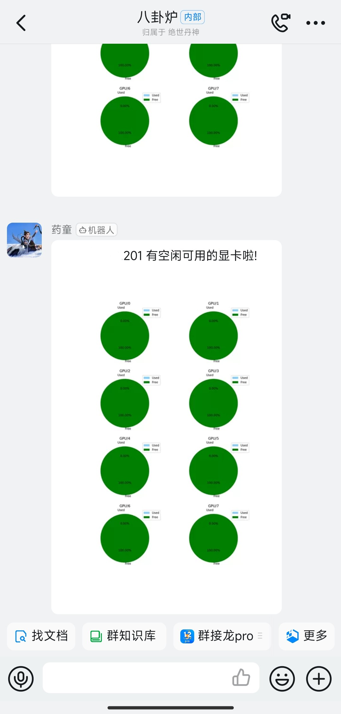

# 八卦炉
训练深度学习模型，就像“炼丹”，模型可能需要训练很多天。我们不可能像「太上老君」那样，拿着浮尘，24 小时全天守在「八卦炉」前，更何况人家还有炼丹童、天兵天将，轮流值守。多个用户使用同一台机器常常发生等待空余显卡的情况，开发本程序目的是监控当前服务器显存情况，如果有空闲每隔一段时间将显卡情况可视化后发送到钉钉群里。
## 方案
1. [nvitop](https://github.com/XuehaiPan/nvitop) 接口获取每个显卡可用显存情况
2. 根据得到的数据使用 matplotlib 绘制饼图
3. 保存饼图到本地然后上传到七牛云存储
4. 将返回的图片外链和文本拼接成 MarkDown 类型的消息
5. 钉钉 SDK 通过 Webhook 将消息发送给客户端
## Usage
### 环境依赖
```bash
pip3 uninstall nvidia-ml-py3 pynvml -y
pip3 install -i https://pypi.tuna.tsinghua.edu.cn/simple nvitop nvidia-ml-py==11.450.51
pip3 install -i https://pypi.tuna.tsinghua.edu.cn/simple requests pandas numpy matplotlib qiniu pyyaml
```
### 配置环境变量


```bash
mv project_example.yaml project.yaml
vim project.yaml

# 主机名
HOST : x.x.x.x
# 发消息间隔时间
INTERVAL : 600
# 钉钉 WEBHOOK_URL
WEBHOOK_URL : 
    DINGDING: https://oapi.dingtalk.com/robot/send?access_token=
# No used
CUDA_VISIBLE_DEVICES : -1

# Qiniu
USE_QINIU:
    # 是否启用七牛云存储
    STATUS: True
    ACCESS_KEY : xxxxxxxxxxxxxxxxxxxxxx
    SECRET_KEY : xxxxxxxxxxxxxxxxxxxxxx
    EXTERNAL_DOMAIN : http://xxxxxxxxx.bkt.clouddn.com/
    BUCKET_NAME : xxxxxxxxx
```
###

### Run
```
mkdir images
python main.py
```
## Demo
### Server


### Client
